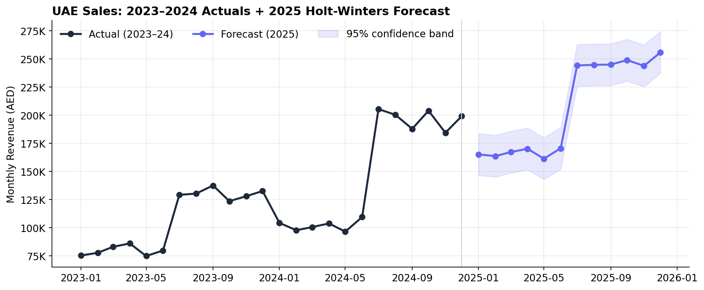

# UAE Sales Forecasting & Time-Series Analysis

A Python time-series project that turns 24 months of agency sales history into a
validated **2025 monthly revenue forecast**, built with **pandas**, **statsmodels**,
and **scikit-learn**. The emphasis is on *honest, interpretable* forecasting —
quantifying the strong seasonal pattern in the data and being explicit about what
a short (24-month) series can and cannot support.




*Actual monthly revenue (2023–2024) with the Holt-Winters forecast for 2025 and its 95% confidence band. The repeating mid-year surge and the year-over-year growth are both visible at a glance.*

> 📓 The full analysis lives in **[`UAE_Sales_Forecasting.ipynb`](UAE_Sales_Forecasting.ipynb)** — GitHub renders it with all charts and outputs inline.

---

## Business Questions

- **How seasonal is the business?** How much higher is the second half of the year, and which months drive revenue?
- **What is the growth trajectory?** How did 2024 compare to 2023, and is the trend sustainable?
- **What should 2025 look like?** What is a defensible month-by-month revenue forecast, with an uncertainty range?
- **What does it mean for planning?** When should capacity, hiring, and budget be deployed?

---

## Key Findings

- **Pronounced H2 seasonality.** July–December months run at **~1.3× the average** while January–June sit at **~0.7×** — the second half of the year is worth nearly double the first, month for month.
- **Strong, consistent growth.** Revenue grew **~42% from 2023 to 2024** (AED 1.26M → 1.79M).
- **2025 forecast: ~AED 2.5M**, implying **~38% YoY growth** — in line with the historical trend, not an outlier.
- **~60% of 2025 revenue is projected to land in H2**, with the peak in Q4.

---

## Method

The notebook walks through a complete, defensible workflow:

1. **Time-series construction** — aggregate 480 transaction records into a clean monthly series with a proper `DatetimeIndex`.
2. **Exploratory analysis** — raw trend, year-over-year overlay, a quantified **seasonal index**, and an additive **seasonal decomposition** (trend + seasonal + residual).
3. **Honest backtesting** — train on 2023, predict 2024, comparing **Seasonal Naïve** vs **Linear Trend** baselines with MAPE / MAE / RMSE. This shows *why* seasonality matters and what any real model must beat.
4. **Forecasting** — **Holt-Winters** (triple exponential smoothing: level + trend + additive seasonality) fit on the full series, projecting 12 months with a 95% uncertainty band.
5. **Business read-out** — translating the forecast into capacity, cash-flow, and budgeting recommendations.

### A note on rigor

This project deliberately foregrounds its own limitations. With only **24 monthly
observations** (two seasonal cycles — the bare minimum to fit a seasonal model),
the notebook explains why the final Holt-Winters forecast cannot be
cross-validated, uses the 2023→2024 backtest as its real out-of-sample evidence,
and frames the 2025 numbers as a *structured projection* rather than a guarantee.
Demonstrating this judgment is part of the point: knowing the ceiling of your data
is a core analyst skill.

---

## Skills Demonstrated

- **Time-series engineering** — resampling transactions to a frequency-aware monthly series.
- **Seasonality analysis** — seasonal indices and additive decomposition.
- **Forecasting** — Holt-Winters exponential smoothing with uncertainty bands.
- **Model validation** — train/test backtesting with multiple error metrics and baseline comparison.
- **Analytical honesty** — explicit treatment of small-sample limitations and assumptions.
- **Communication** — translating statistical output into business actions.

---

## Repository Structure

```
.
├── UAE_Sales_Forecasting.ipynb   # The analysis (renders on GitHub with outputs)
├── data/
│   └── UAE_sales_data.csv        # Source dataset (480 records, 2023–2024)
├── images/
│   └── forecast_2025.png         # Forecast chart (shown in README)
├── requirements.txt
└── README.md
```

---

## How to Run

```bash
pip install -r requirements.txt
jupyter notebook UAE_Sales_Forecasting.ipynb
```

Then run all cells (Kernel → Restart & Run All). The notebook expects
`data/UAE_sales_data.csv` relative to its location.

---

## Related Project

This forecasting analysis is a companion to the interactive
**[UAE Market Sales Analytics dashboard](https://github.com/atifarif-data-analyst/UAE_Market_Sales_Analytics)**
(Streamlit + Plotly), which explores the same dataset descriptively. The dashboard
is also **[deployed live](https://uhvcw2pktadjl2y6ujrapp9.streamlit.app)**. Together they
cover the analytics spectrum: *what happened* (dashboard) and *what's next* (forecast).

---

*Built with pandas, statsmodels, and scikit-learn. Sales figures in AED. Dataset
models a UAE digital-services agency's 2023–2024 performance.*
